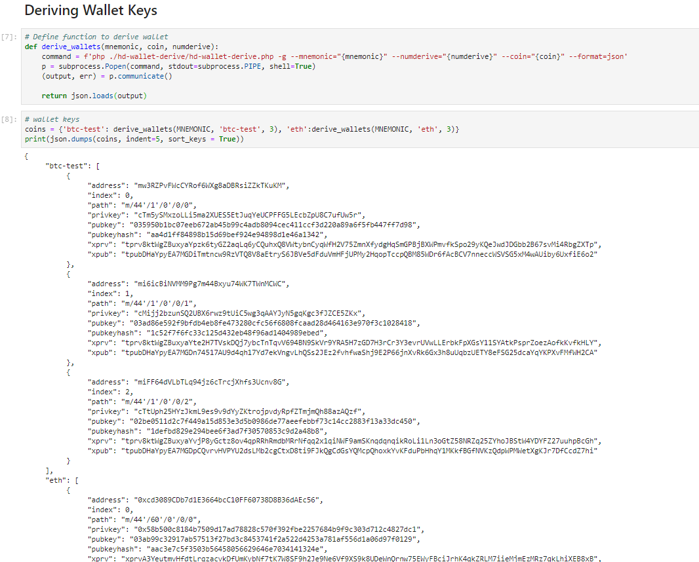
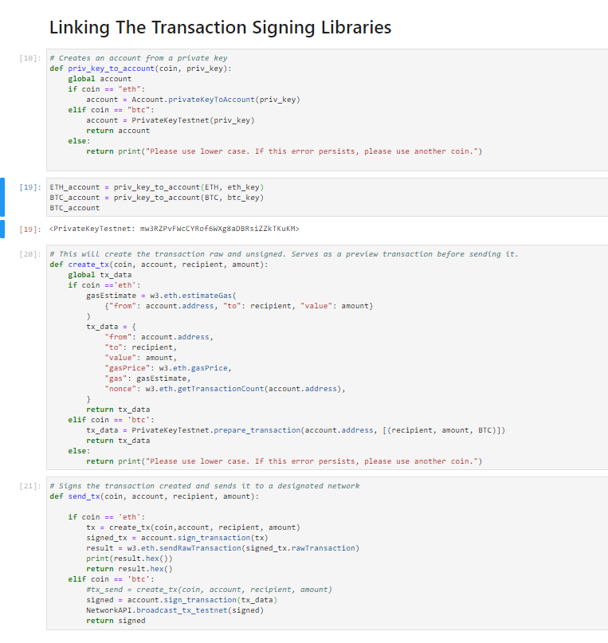
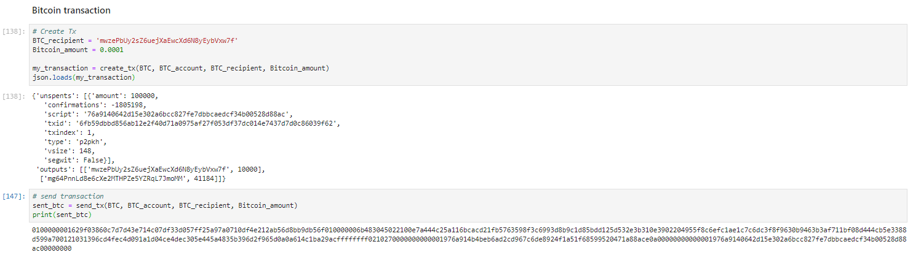
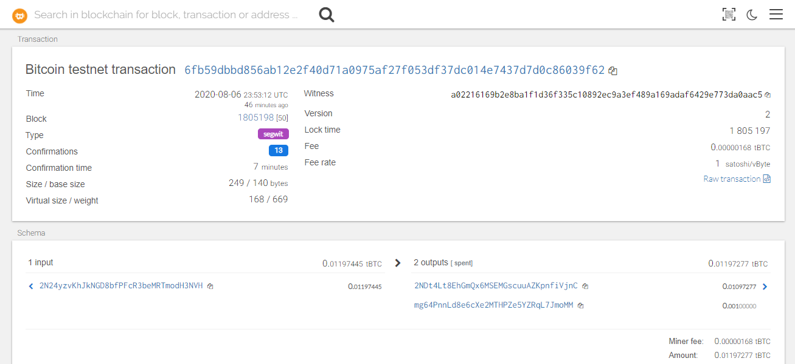
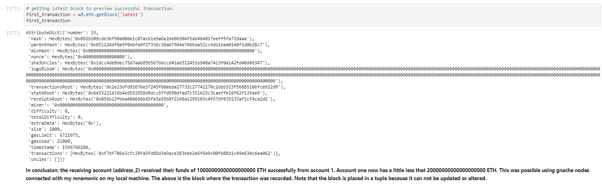

# Multi-Blockchain Wallet

### Summary
This wallet gives users the power to make secure transactions accross the bit and web3 network. Currently, the wallet supports bitcoin and ethereum, but will include other ERC20 registered coin types in later updates. By entering a 12 word mnemoic, users can access their HD wallets and create as many child keys as needed to store their funds. Once verified, users can also initiate transactions where they will receive a preview prompt before sending funds to other recipients. Once a transaction is complete, users can access their transaction status, their current balance, and their blocks on the blockchain.

### Testing Code at No Cost
Testing cryptocurrency transactions on a live network can be expensive. Therefore, to test the code without exhausting any funds, I created a custom blockchain network. Please see article where I listed all the steps involved in this process: https://emilianoamador.github.io/Blockchain_Custom_Network/

### The Nuts and Bolts
To load the wallet child keys, I used a subprocess to access HD-wallet and to visualize the addresses. I created a function with three parameters to give users the ability to enter their mnemonic, choose their desired coin, and how many wallets they want to create.  

Before creating a transaction, I connected to the network using web3 http provider with my own local host address and private key. Then I checked if my nodes were connected to my local network and if the correct consensus algorithm was working properly.

To initiate transactions, the user needs to make an account out of the private keys provided in the child wallets. To do this they can use the function priv_key_to_account in order to generate one. Once this is done, they can use create_tx function to make a transaction. This function prompts the user to input their created account, coin type, amount of money to send, and the address of the recipient they want to send to. To process the ethereum coins, we used web3 library functions, and to process the bitcoin coins we used the bit.network API functions. To send the transactions, simply use the send_tx function which signs off the transaction previously created in the last step. In other words, this function initiates the petition for the transaction to be reviewed by the consensus algorithm. Once validated, the funds are transfered and the transaction details are added to the blockchain as a transaction block. 

The user can check the transaction details in the blockchain by using a hash code provided upon initiating a transaction. This hash code is important because each coin's blockchain contains millions of transactions so manually searching it is nearly impossible. The hash code can access the transaction blocks via the bit network and Ethereum Network which filters the blocks as well as the transaction status.

Lastly, the user can check his balance by using the web3 getBalance function. 
**The functions created:**

**Checking Balance:**
  > **w3.eth.getBalance("INSERT-PRIVATE-KEY")**

**Retrieving the block from the blockchain**

