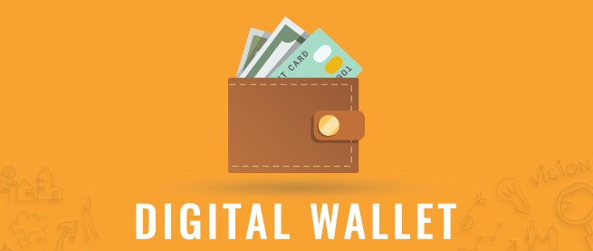

# Multi-Blockchain_Wallet: Using BIP-44 Multi-Account Hierarchy 

### Summary
This wallet gives users the power to make secure transactions accross the bit and web3 network. Currently, the wallet supports bitcoin and ethereum, but will include other SLIP-0044 registered coin types in later updates. by entering a 12 word mnemoic, users can access their HD wallets and create as many child keys as needed. Users can also create transactions to preview and send to other recipients. Once the transactions are complete, users can access their transaction status, their current balance, and their blocks on the blockchain.

### The Nuts and Bolts
To load the wallet child keys, we used subprocess to access HD-wallet and visualize the addresses. These lines of code were placed inside a function called derive_wallets and the outputs stored in variables for later access. by giving the 3 parameters to the function we give the user the ability to enter their mnemonic, chooses their desired coin, and how many wallet addresses they want to derive.  

Before creating a transaction, we connected to the network using web3 http provider, with our local host address and private key. Then we checked if our nodes were connected to pur PoA local network.

To initiate transactions, the user needs to make an account out of the private keys provided in the child wallets. To do this they can use the function priv_key_to_account in order to generate one. Once this is done they can use a function called create_tx. This function allows the user to input their created account, coin type , amount of money to send, and the address of the recipient they want to send to. To process the ethereum coins, we used web3 library functions, and to process the bitcoin coins we used the bit.network API functions. To send the transactions simply use the send_tx function which signs the transaction previously created. In other words, this function initiates the petition for the transaction and once validated are added to the blockchain as a transaction block. Congratulations, your transaction has been made. To check, we simply used bit network and web3 to retireve the blocks as well as the transaction confirmations. Lastly, to check the balance we used web3 get balance. 

**The functions created:**

**Checking Balance:**
  > **w3.eth.getBalance("INSERT-PRIVATE-KEY")**

**Retrieving the block from the blockchain**

